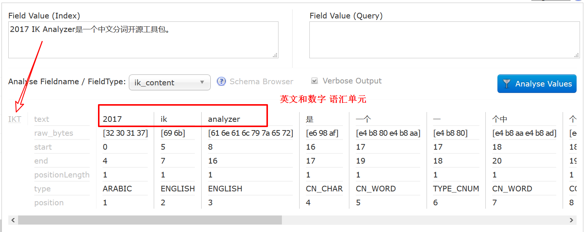
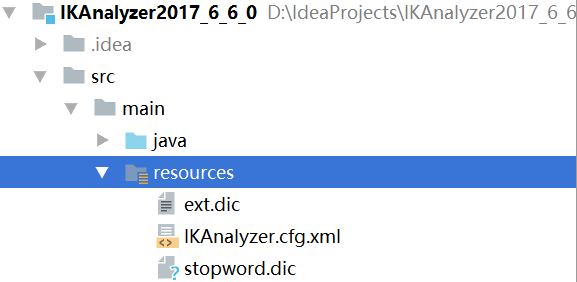
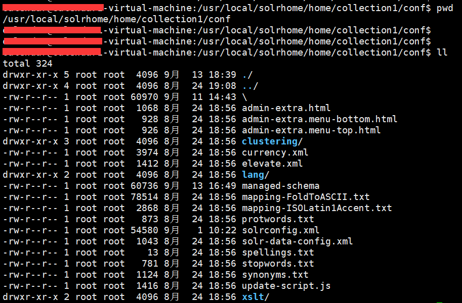
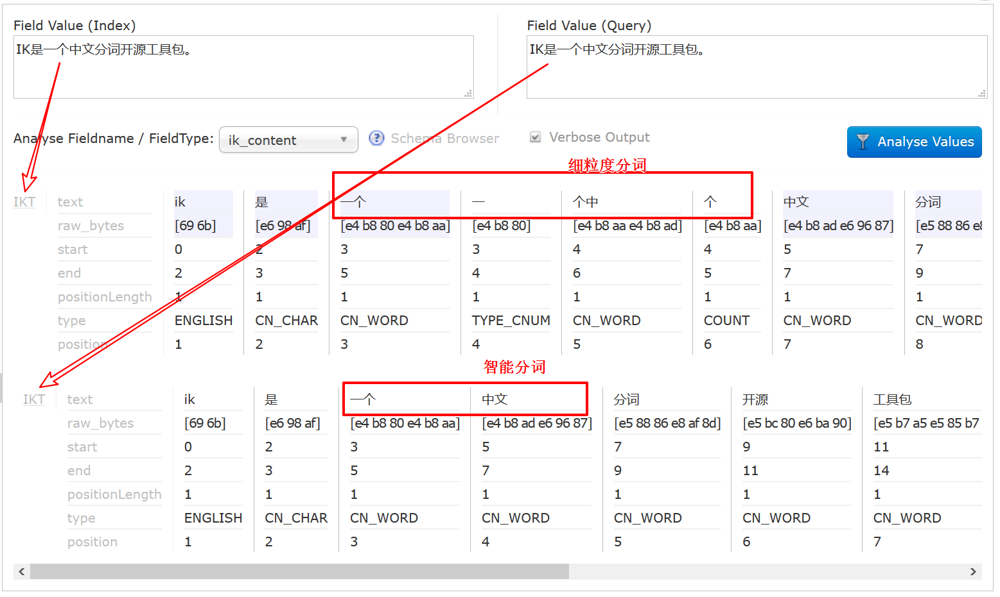
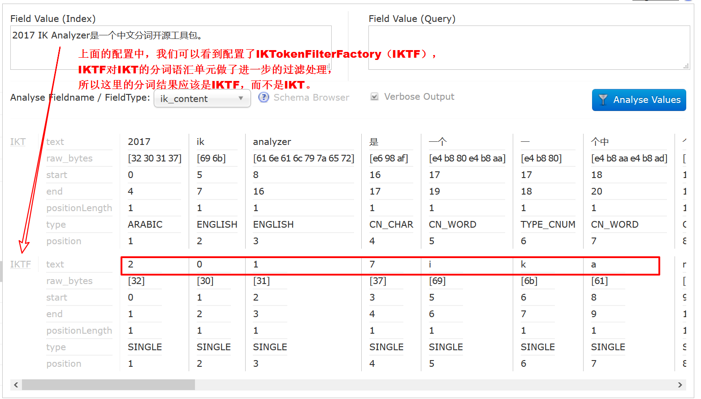
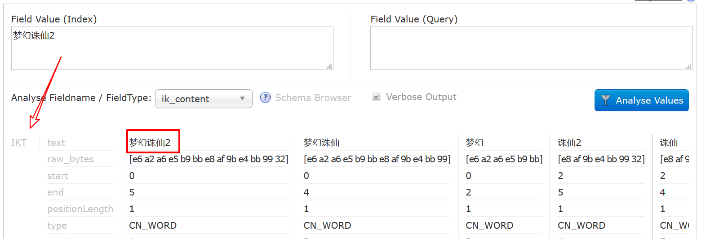

# IKAnalyzer2017_6_6_0

码云:[https://git.oschina.net/iicode/IKAnalyzer2017_6_6_0](https://git.oschina.net/iicode/IKAnalyzer2017_6_6_0)

Github:[https://github.com/ittalks/IKAnalyzer2017_6_6_0](https://github.com/ittalks/IKAnalyzer2017_6_6_0)

IKAnalyzer2017_6_6_0.jar:[https://github.com/ittalks/IKAnalyzer2017_6_6_0/releases/download/v1.0.0/IKAnalyzer2017_6_6_0.jar](https://github.com/ittalks/IKAnalyzer2017_6_6_0/releases/download/v1.0.0/IKAnalyzer2017_6_6_0.jar)

Solr作为搜索应用服务器，我们在使用过程中，不可避免的要使用中文搜索。
以下介绍solr的**第三方分词器IKAnalyzer**。

注：下面操作在Linux下执行，所添加的配置在windonws下依然有效。

运行环境
- Solr：6.6.0
- 系统 : Linux

以下是设置solr中文分词器的方法。

>注：开始之前，假定你已经成功登录solr的界面，并创建了core。

## 新特性

在使用`IKAnalyzer`分词器之前，先说明由于作者在12年之后没有更新，导致旧版本的分词器和新版本的solr6.6.0无法匹配。
因此在源码的基础上做些改动，以兼容新版的solr。

- 兼容新版的solr6.6.0；
- 英文和数据支持单字分词；

IK中文分词对于数字和英文的分词方式是：**一个英文单词为一个语汇单元，一个数值为一个语汇单元**。
比如："**2017 IK Analyzer是一个中文分词开源工具包。**"这个句话使用IK中文分词后的结果为：



所以针对**数值**和**英文单词**的部分搜索支持不好。

如果你搜"**345**"是搜索不出来结果的，当然你可以使用lucene查询表达式或者`WildcardQuery`使用通配符查询。
但是如果搜索"**456 IK Analy**"，又该如何处理，情况会变得更加复杂。

所以这里针对数值和英文单词做了**单字分词**，能更好的处理这些情况。

>人们经常会因为忘了某些单词或者数字的具体内容，则只输入部分内容

## 配置IKAnalyzer

这里把Tomcat的路径为`/usr/local/apache-tomcat-8.5.5`做说明。

一、将 IK Jar包和配置文件上传到Linux系统中，copy IK Jar包到 `/usr/local/apache-tomcat-8.5.5/webapps/solr/WEB-INF/lib` 目录下。
即copy IK Jar包到solr项目的lib目录下。

```text
cp IKAnalyzer2017_6_6_0.jar /usr/local/apache-tomcat-8.5.5/webapps/solr/WEB-INF/lib/
```

二、复制配置文件到 `solr/WEB-INF/classes`目录下(没有classes，则创建)

```text
cp ext.dic IKAnalyzer.cfg.xml stopword.dic /usr/local/apache-tomcat-8.5.5/webapps/solr/WEB-INF/classes/
```

注意`IKAnalyzer.cfg.xml`的配置，以启用停用词点和扩展词典。

```xml
<?xml version="1.0" encoding="UTF-8"?>
<!DOCTYPE properties SYSTEM "http://java.sun.com/dtd/properties.dtd">  
<properties>  
	<comment>IK Analyzer 扩展配置</comment>
	<!--用户可以在这里配置自己的扩展字典 -->
	<entry key="ext_dict">ext.dic;</entry> 
	
	<!--用户可以在这里配置自己的扩展停止词字典-->
	<entry key="ext_stopwords">stopword.dic;</entry> 
	
</properties>
```

>这里我特别说明一下，为了方便，我将这三个配置文件集成到了IK Jar包中，所以这里第二步可以省略。



此外，
- `ext.dic`:IK扩展词典；
- `stopword.dic`:IK停用词词典。这里，我删除了停用词，以支持停用词的查询；
- `IKAnalyzer.cfg.xml`:IK配置文件；

>当然，你也可以Fork [IKAnalyzer2017_6_6_0](https://github.com/ittalks/IKAnalyzer2017_6_6_0)，
移除`resources`目录下的这三个文件，重新打包。然后按照步骤二分别配置。

三、进入`solrhome`中打开`managed-schema`文件，添加`IKAnalyzer`配置。

这里我以修改`collection1`作为示范。

我的路径配置路径：`/usr/local/solrhome/home/collection1/conf`，请根具个人路径修改配置文件



```text
<!-- IKAnalyzer Field-->
<field name="ik_filename" type="IK_cnAnalyzer" indexed="true" stored="true"  multiValued="true"/>
<field name="ik_keywords" type="IK_cnAnalyzer" indexed="true" stored="false" multiValued="true"/>
<field name="ik_content" type="IK_cnAnalyzer" indexed="true" stored="true" multiValued="true"/>

<!-- IKAnalyzer -->
<fieldType name="IK_cnAnalyzer" class="solr.TextField" positionIncrementGap="100">
    <analyzer type="index">
        <tokenizer class="org.wltea.analyzer.lucene.IKTokenizerFactory" useSmart="false"/>
        <filter class="org.wltea.analyzer.lucene.IKTokenFilterFactory" useSingle="true" useItself="false" />
    </analyzer>
    <analyzer type="query">
        <tokenizer class="org.wltea.analyzer.lucene.IKTokenizerFactory" useSmart="false"/>
        <filter class="org.wltea.analyzer.lucene.IKTokenFilterFactory" useSingle="true" useItself="false" />
    </analyzer>
</fieldType>

<copyField source="ik_content" dest="ik_keywords"/>
<copyField source="ik_filename" dest="ik_keywords"/>
```

这里只是举个栗子，请根据个人需要修改配置文件。

## 配置详解

在`Analyzer`(分析器)中设置了`index`和`query`说明**创建索引**和**查询**的时候都使用分词，
因此如果有特殊要求，可以指定索引和查询时候设置不同的分词器。

### 智能分词&细粒度分词

`IKTokenizerFactory`是IK原生的分词器
- `useSmart`：设置是否使用智能分词。默认为false，使用细粒度分词



### 单字分词

`IKTokenFilterFactory`是我做的扩展，以支持**数值**和**英文单词**的单字分词，
- `useSingle`：设置是否对英文和数字单字分词。默认false。
- `useItself`：是否保留英文和数字原语汇单元。默认true。



### 扩展词库

`IKAnalyzer.cfg.xml`中我们配置了扩展词典，同时`ext.dic`词典中配置了如下扩展词汇：

```text
诛仙
诛仙2
梦幻诛仙
梦幻诛仙2
```

solr遇到这些词汇，不仅对其进行分词，还会把它整体作为一个语汇单元创建索引。

我们做下测试：

